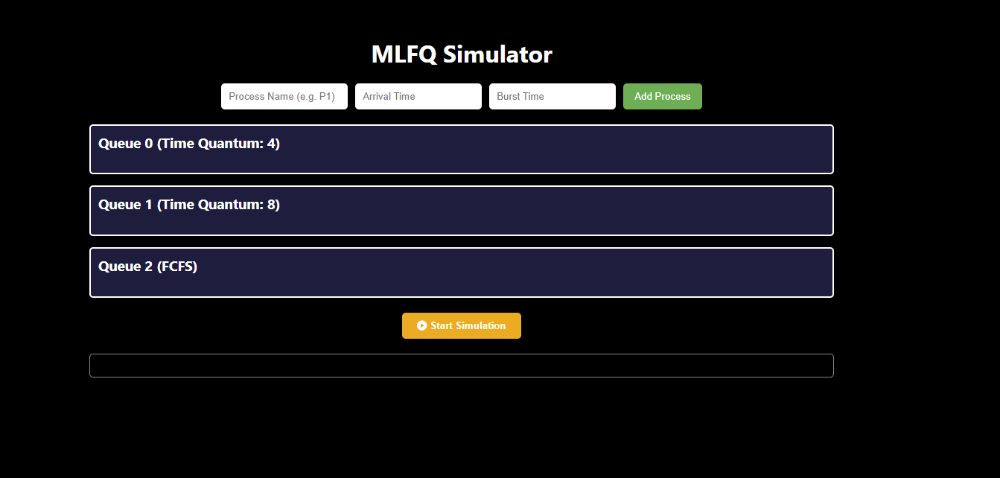

# 🌐 Mô phỏng thuật toán MLFQ – Multilevel Feedback Queue CPU Scheduling


---

**Website mô phỏng trực quan thuật toán điều độ CPU: MLFQ (Multilevel Feedback Queue) được xây dựng bằng HTML, CSS và JavaScript.**

<!--   Chèn hình ảnh demo tại đây -->


## 🎯 Giới thiệu | Introduction

Đây là đồ án cuối kỳ môn **Lập trình Hệ điều hành**, với mục tiêu xây dựng một trang web mô phỏng trực quan hoạt động của thuật toán lập lịch CPU nổi tiếng – **Multilevel Feedback Queue (MLFQ)**.

Trang web giúp người học, đặc biệt là sinh viên ngành CNTT, hiểu rõ hơn về cách thuật toán MLFQ xử lý các tiến trình qua từng cấp độ hàng đợi ưu tiên, thời lượng CPU, và các bước điều phối.

This is a final course project for *Operating System Programming*. It provides an interactive simulation of the **Multilevel Feedback Queue (MLFQ)** CPU scheduling algorithm using modern web technologies.

---

## 🛠️ Công nghệ sử dụng | Technologies

- HTML5
- CSS3 (kèm hiệu ứng transition, animation)
- JavaScript (DOM, mô phỏng hàng đợi)
- (Future upgrade: Java backend, modern JS frameworks...)

---

## 🚀 Tính năng nổi bật | Key Features

✨ **Giao diện hiện đại**:  
- Landing page cuốn hút với video nền, hiệu ứng cuộn mượt.  
- Navbar có icon, responsive design.

---

🧠 **Mô phỏng trực quan**:  
- Giao diện mô phỏng tương tác, cho phép người dùng nhập tiến trình.  
- Hiển thị từng bước hoạt động của thuật toán MLFQ.  
- Hỗ trợ thay đổi thông số và tự động tính toán.

📘 **Trang hướng dẫn (Tutorial)**:  
- Giải thích lý thuyết MLFQ và cách sử dụng trình mô phỏng.

👥 **About Us**:  
- Thông tin nhóm phát triển.

🌐 **Chuyển trang mượt mà**  
- Sử dụng `window.location` kết hợp hiệu ứng điều hướng.

🖼️ **Demo & Hình ảnh**:
- [](https://www.youtube.com/watch?v=YOUR_VIDEO_ID) <!-- Chèn link video demo -->
- [**Hình ảnh giao diện**](./Demo/MainPage.png) <!-- Chèn hình ảnh mô phỏng -->

---

## 🧑‍💻 Nhóm thực hiện | Project Team

Dự án được thực hiện theo nhóm với phương pháp phát triển linh hoạt, các thành viên cùng đóng góp vào tất cả các phần mà không chia nhiệm vụ cụ thể.

This project was developed by a collaborative team without strict role assignment – each member contributed to various parts of the system.

### 👥 Đội Ngũ Phát Triển
Chúng tôi là một nhóm đam mê công nghệ, cùng nhau phát triển dự án này:
- [**Thu-master** 🔗](https://github.com/Thu-master)
- [**Hà Hiệp Thanh** 🔗](https://github.com/HaHiepThanh)

---

## 📦 Cách chạy dự án | How to Run

1. Clone repo về máy:
   ```bash
   git clone https://github.com/Thu-master/LTHDH_Project.git

2. Mở file index.html bằng trình duyệt (Chrome/Edge/Firefox...)

3. Down extension VSCode và chạy golive trên VSCode(nếu cần)

## 📚 Nội dung thư mục | Folder Structure**
```
Project-LTHDH/
│
├── Back-end/
│ └── (Hiện tại chưa có nội dung cụ thể)
│
├── Background/
│ ├── 12686138_3840_2160.jpg # Hình nền
│ └── vdo.mp4 # Video nền trang landing
│
├── Front-end/
│
│ ├── CSS/
│ │ ├── loginStyle.css # Giao diện form đăng nhập
│ │ ├── simulatorStyle.css # Giao diện trình mô phỏng
│ │ ├── style.css # Giao diện tổng thể
│ │ └── tutorialStyle.css # Giao diện trang hướng dẫn
│
│ ├── HTML/
│ │ ├── C-SCAN.html # Mô phỏng thuật toán C-SCAN
│ │ ├── FCFS.html # Mô phỏng thuật toán FCFS
│ │ ├── FIFO.html # Mô phỏng thuật toán FIFO (paging)
│ │ ├── index.html # Trang landing chính
│ │ ├── login.html # Trang đăng nhập
│ │ ├── LRU.html # Mô phỏng thuật toán LRU (paging)
│ │ ├── OPTIMAL.html # Mô phỏng thuật toán OPTIMAL (paging)
│ │ ├── SCAN.html # Mô phỏng thuật toán SCAN
│ │ ├── SRTF.html # Mô phỏng thuật toán SRTF
│ │ ├── simulator.html # Giao diện mô phỏng MLFQ
│ │ └── Tutorial.html # Trang hướng dẫn sử dụng
│
│ └── JS/
│ ├── C-SCAN.js # Logic mô phỏng C-SCAN
│ ├── FCFS.js # Logic mô phỏng FCFS
│ ├── FIFO.js # Logic mô phỏng FIFO
│ ├── login.js # Xử lý đăng nhập
│ ├── LRU.js # Logic mô phỏng LRU
│ ├── OPTIMAL.js # Logic mô phỏng OPTIMAL
│ ├── SCAN.js # Logic mô phỏng SCAN
│ ├── script.js # Script tổng hợp (nếu có)
│ ├── SRTF.js # Logic mô phỏng SRTF
│ └── tutorial.js # Script hướng dẫn
│
├── .gitignore
├── LICENSE
├── README.md
└── temp.txt # Ghi chú tạm
```
## 🛡️ Giấy Phép | LLicense
Phần mềm này được sử dụng nội bộ và không dành cho mục đích thương mại.

This software is for internal use only and is not intended for commercial purposes.